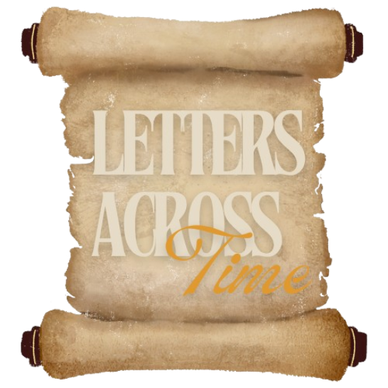
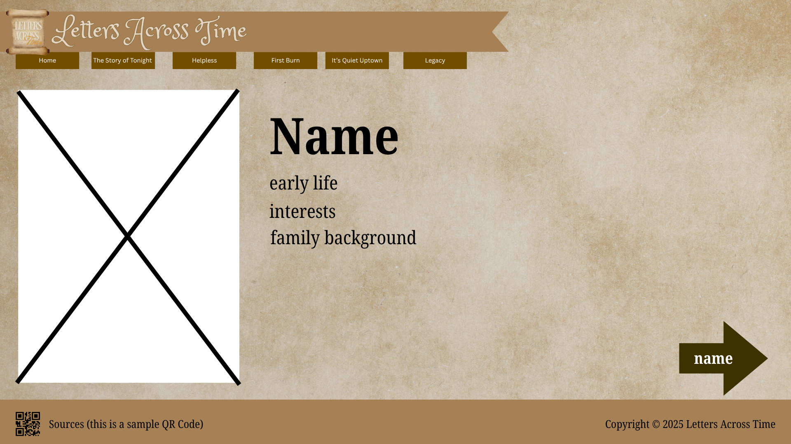
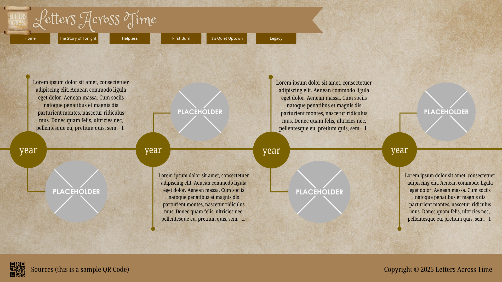

# WDProjBerylliumGesiteOngkeko

### Letters Across Time. 
### The legacy that burned, and the love that survived the fire.

---

Logo:

**Description:** Behind Hamilton’s songs and stories of war, revolution, and political rivalry lies a tale of love that endured the fires of ambition and betrayal. *Letters  Across  Time* allows visitors to experience this story from two different perspectives: Alexander Hamilton and Eliza Schuyler Hamilton. 

Each version of the site reveals the same key moments—love, loss, forgiveness—but through different eyes. Visitors will feel the difference in tone, design, and emotional detail as they switch between Hamilton’s ambition-driven world and Eliza’s heart-centered narrative. Beyond history, this interactive experience highlights how two people’s truths can intertwine to form one lasting legacy.

---
**Webpage Breakdown:**

Homepage: The Home page introduces the website and allows visitors to choose between Hamilton’s or Eliza’s version of the story. This choice will affect how the rest of the site looks and what details are emphasized in each section. It also includes navigation links to all other pages.

P1 (The Story of Tonight): The Story of Tonight page gives background information about Alexander and Eliza, including their early lives and the historical setting of the American Revolution. This page helps users understand how their personal story connects to the time period.

P2 (Helpless): The Helpless page focuses on their courtship and marriage. It features a timeline slider made with JavaScript, where users can move through key events like their meeting, marriage, and the birth of their children.

P3 (First Burn): The First Burn page covers the Reynolds affair and how it affected both of them. Depending on the chosen perspective, users can read either Hamilton’s explanation or Eliza’s emotional response.

P4 (It's Quiet Uptown): The It’s Quiet Uptown page shows the period of grief and forgiveness after the death of their son and Hamilton’s own passing. The tone and layout will shift to reflect the solemn mood.

P5 (Legacy): Finally, the Legacy page shows how Eliza carried on Hamilton’s legacy, including her charitable work and how their story continues to inspire modern culture. The Sources section will be placed at the bottom of all pages as a QR code to list all references used in the website.

---
**Other Notes:**

- JavaScript will be used to make the website interactive and engaging. On the Home page, users will be able to choose whether to view the story from Hamilton’s or Eliza’s perspective. Once a choice is made, JavaScript will automatically adjust the theme, text highlights, and small details (such as quotes or side notes) across all pages to match that perspective.

- In addition, the Helpless page will feature a timeline slider created using JavaScript. This interactive element will allow users to scroll or click through key moments in Alexander and Eliza’s relationship, with corresponding images and descriptions appearing as they move along the timeline. These uses of JavaScript will make the storytelling experience more dynamic and personalized for each visitor.

---
**Wireframes:**

Homepage: 

First Page:

Second Page:

------------------------------------------------

## 3rd Quarter Project HTML Form Proposal

### HTML Form Design and Purpose

The website will include an HTML form designed to allow users to reflect on historical events from the time of Alexander Hamilton and Elizabeth Schuyler Hamilton. The purpose of the form is to collect user responses in a more interactive and educational way, encouraging users to think critically about leadership, values, and decision making during the Revolutionary era.

The form will ask users to write a short reflection in a free text field and answer a few short multiple choice questions. These questions will be used to analyze the user’s perspective and determine which historical character (Alexander Hamilton or Eliza Schuyler) they are most similar to. The form will appear on a dedicated webpage and will only require the user to submit their responses once.

All data collected through the form will be saved on the user’s computer using the browser’s localStorage feature. This allows the website to retrieve the saved information and display personalized content on other webpages without asking the user to re enter their responses.

---

### Design of New Webpages

The proposed update includes the design of three new webpages that demonstrate how the HTML form collects and uses user data.

1. **`reflection-form.html`**  
   This page displays the HTML form, where users write their reflection and answer short multiple choice questions. When the form is submitted, the responses are saved to localStorage.

2. **`reflection-result.html`**  
   This page retrieves the saved reflection from localStorage and displays it back to the user. It allows users to view their written response and see how it connects to the historical themes presented on the website.

3. **`character-match.html`**  
   This page uses the saved answers from the form to determine whether the user most closely aligns with Alexander Hamilton or Elizabeth Schuyler Hamilton. The page displays the matching character along with a brief explanation based on the stored data.

---

### Wireframes

You may view the wireframes here: [canva link]

